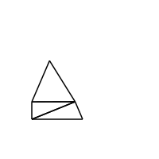
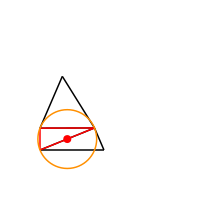
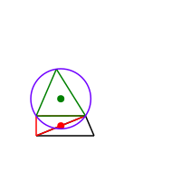
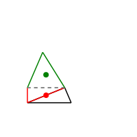
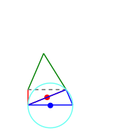
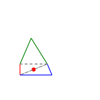
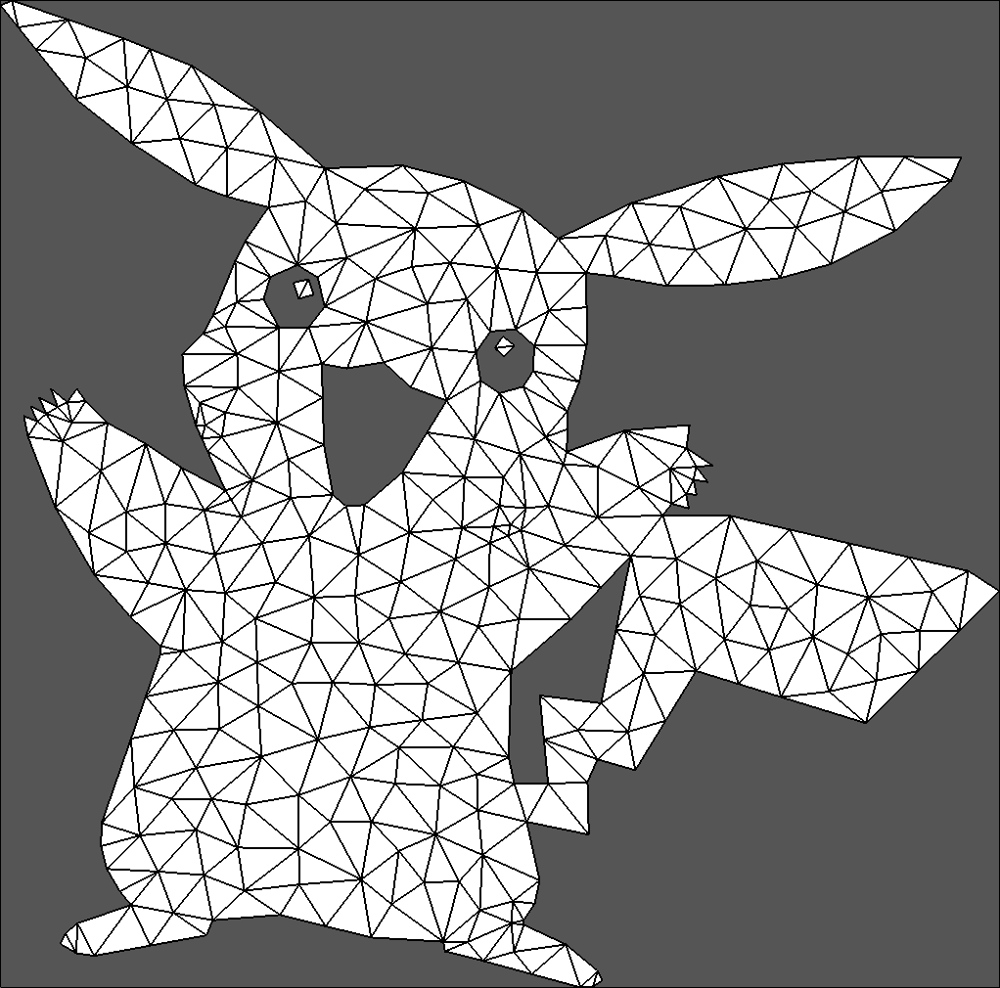

# Delaunay Cavity: Polygonal meshing algorithm based on cavities
Algorithm inspired by polylla to generate polygonal meshes of arbitrary shape, using a delaunay triangulation as input. This algorithm uses the concept of a "cavity", where a cavity is defined as the union of adjacent triangles from a starting seed triangle that contain the circumcenter of the seed within their own circumcenter.
<p align="center">







</p>

This algorithm supports a plethora of methods to decide the order in which seed triangles should be selected, be it by minimum angles, longest edges, among others.

## Compilation
To compile this project, Cmake 3.10 and C++20 are required, the CMakeLists.txt file can be edited manually to compile the desired target. For convenience, the `interactive_build.py` file is provided which invokes the appropriate cmake command to compile the desired target.

Each different setting of triangle selection and pre or post processing is a distinct executable, at present, the total amount of different unique configurations is about 420, so compiling every target can take a very long time, discretion is advised.

Do note that the executable files generated by this project have very long names, so it's highly recommended to not nest the root folder of the project too deep in your computer's storage. It is also mandatory to disable [Windows' path size limit](https://www.howtogeek.com/266621/how-to-make-windows-10-accept-file-paths-over-260-characters/). Python asks you if you want to do this when installing it, so chances are that it's already done.

## Usage
Once a particular target is compiled, you can invoke the executable with the `--help` flag to see more information, printing something that looks like this:
```
OPTIONS:
  -h,     --help              Print this help message and exit
          --off-input         Read input from an off file
          --threshold FLOAT   Threshold to use for selection criterion
          --config [delaunay_cavity_generator.toml]
                              Read inputs from a .toml file
          --off-output        Write to off file
          --ale-output        Write to ale file
          --json-output       Write stats to json file
          --input1 TEXT:FILE REQUIRED
                              First input file, must be either .node or .off
  -o,     --output TEXT       Output base filename/path for outputs if any, defaults to output
                              at same path of input
[Option Group: Input groups]

OPTIONS:
  -h,     --help              Print this help message and exit
          --input2 TEXT:FILE  .ele file
          --input3 TEXT:FILE  .neigh file
```

The program is capable of reading meshes in the `.node/.ele/.neigh` and `.off` formats by specifying them with the appropriate flags. It is also possible to read the same arguments listed above from a configuration file and pass the path to the file with the `--config` flag.

Old readme for polylla below

# Polylla: Polygonal meshing algorithm based on terminal-edge regions
<p align="center">
 
</p>
New algorithm to generate polygonal meshes of arbitrary shape, using any kind of triangulation as input, adaptable to any kind of complex geometry, no addition of extra points and uses the classic Doubly connected edge list (Half edge data struct) easy to implement wih another programming language.

<p align="center">

</p>

The algorithm needs a initial triangulation as input, any triangulations will work, in the following Figure the example of a Planar Straigh Line Graph (PSLG) with holes (left image), triangulizated (middle image) to generate a Polylla mesh (right image).

<p align="center">
 
 
 
</p>

<p align="center">
 
 
 
</p>


## IO formats

The algorithm supports two file formats as input, the output is an [.off file](https://en.wikipedia.org/wiki/OFF_(file_format)) and an .ale file use for the VEM.

### Input as  .node, .ele, .neigh files

Triangulation is represented as a [.node file](https://www.cs.cmu.edu/~quake/triangle.node.html) with the nodes of the triangulations and the [boundary marker](https://www.cs.cmu.edu/~quake/triangle.markers.html), [.ele file](https://www.cs.cmu.edu/~quake/triangle.ele.html) with the triangles of the triangulations and a [.neigh file ](https://www.cs.cmu.edu/~quake/triangle.neigh.html) with the adjacencies of each triangle. 


Input commands of polylla are:

```
./Polylla <input .node> <input .ele> <input .neigh> <output filename>
```

Example to generate pikachu

```
./Polylla ./Polylla pikachu.1.node pikachu.1.ele pikachu.1.neigh out
```


### Input as a .off file


```
./Polylla <input .off> <output filename>
```


## Shape of polygons

Note shape of the polygon depend on the initital triangulation, in the folowing Figure there is a example of a disk generate with a Delaunay Triangulation with random points (left image) vs a refined Delaunay triangulation with semi uniform points (right image).

<p align="center">
 
 
</p>


## Scripts

Scripts made to facilizate the process of test the algorithm:

 - (in build folder) To generate random points, an initital triangulation and a poylla mesh

    ```
    ./generatemesh.sh <number of vertices of triangulation>
    ```


 - (in build folder) To generate mesh from files .node, .ele, .neigh with the same name 

    ```
    ./generatefromfile.sh <filename> <output name>
    ```

   ```
    ./generatefromfile.sh pikachu.1 out
   ```

Triangulazitation are generated with [triangle](https://www.cs.cmu.edu/~quake/triangle.html) with the [command -zn](https://www.cs.cmu.edu/~quake/triangle.switch.html).


## TODO


### TODO scripts

- [ ] Line 45 of plotting depends on a transpose, store edges directly as the transpose of edge vectors and remove it.
- [ ] Define an input and output folder scripts
- [ ] Define -n in plot_triangulation.py to avoid label edges and vertices
- [ ] Change name plot_triangulation.py to plot_mesh.py

### TODO Poylla
- [ ] Travel phase does not work with over big meshes (10^7)
- [ ] Add high float point precision edge lenght comparision
- [ ] POSIBLE BUG: el algoritmo no viaja por todos los halfedges dentro de un poligono en la travel phase, por lo que pueden haber semillas que no se borren y tener poligonos repetidos de output
- [ ] Add arbitrary precision arithmetic in the label phase
- [ ] Add frontier-edge addition to constrained segmend and refinement (agregar método que dividida un polygono dado una arista especifica)
- [X] hacer la función distance parte de cada halfedge y cambiar el ciclo por 3 comparaciones.
- [X] Add way to store polygons.
- [ ] iterador de polygono
- [X] Vector con los poligonos de malla
- [ ] Método para imprimir SVG
- [ ] Copy constructor
- [ ] half-edge constructor
- [X] Change by triangle bitvector by triangle list
- [X] Remove distance edge


### TODO Halfedges 


- [ ] edge_iterator;
- [ ] face_iterator;
- [ ] vertex_iterator;
- [ ] copy constructor;
- [X] constructor indepent of triangle (any off file now works)
- [X] default constructor
- [ ] definir mejor cuáles variables son unsigned int y cuáles no
- [X] Change by triangle bitvector by triangle list
- [ ] Calculate distante edge
- [ ] Read node files with commentaries

### TODO C++

- [X] change to std::size_t to int
- [X] change operator [] by .at()
- [X] add #ifndef ALL_H_FILES #define ALL_H_FILES #endif to being and end header
- [ ] add google tests
- [ ] Add google benchmark


### TODO github

- [ ] Add how generate mesh from OFF file
- [X] Add images that show how the initial trangulization changes the output
- [X] Add the triangulation of the disks
- [X] Hacer el readme más explicativo
- [ ] Add example meshes
- [X] Add .gitignore
- [ ] Poner en inglés uwu